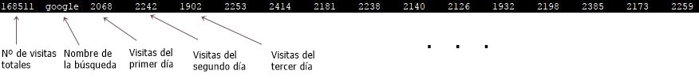
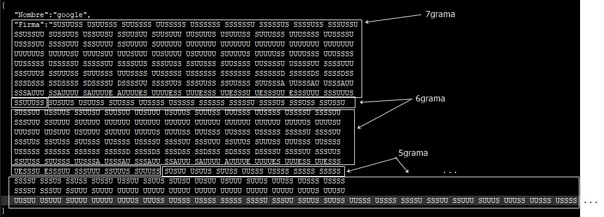
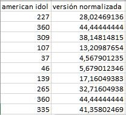
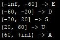
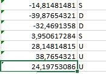
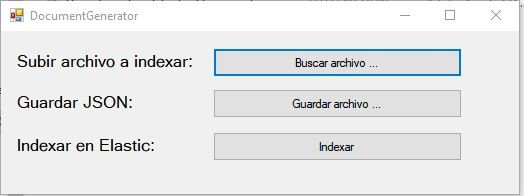
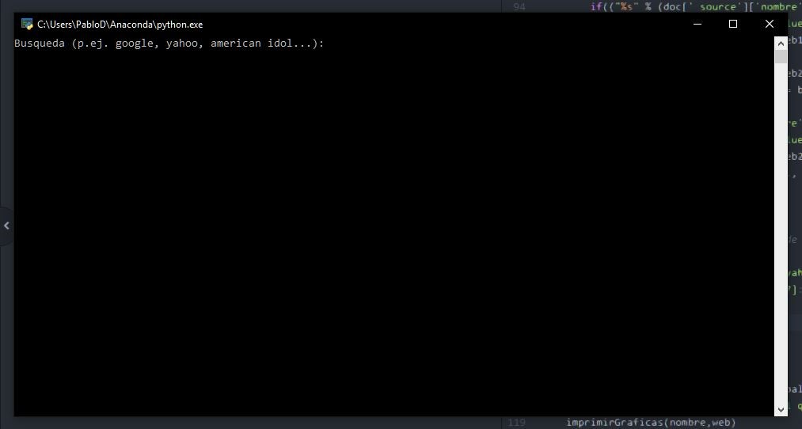

# ELASTICSEARCH CORRELATE

#### AUTOR: ANTONIO PAYÁ GONZÁLEZ 

## ÍNDICE:

- INTRODUCCIÓN
   - 1.- Utilización de archivos de firmas para consultar datos de series temporales
   - 2.- Generador de JSON e indexado........................................................................................................
   - 3.- Ejecutable principal....................................................................................................

## INTRODUCCIÓN

Vamos a crear una aplicación que funcione de manera parecida a como lo hace Google Correlate,
que a partir de una búsqueda encuentra otras búsquedas correlacionadas, así como su porcentaje
de correlación y muestra una gráfica la comparación de ambas.

## BASES TEÓRICAS

### 1.- Utilización de archivos de firmas para consultar datos de series temporales

### series temporales

El conjunto de datos usado para realizar esta práctica no es el de tweets mostrado en las clases de
prácticas.

Se ha utilizado un documento txt que incluye nombres de búsquedas de páginas web (como puede
ser google, [http://www.google.com,](http://www.google.com,) yahoo, hotmail.com, etc.), así como un número de visitas asociado,
que va variando cada día.

A partir del txt, se saca un fichero en formato JSON.

El JSON se compone de datos con un nombre y una firma. El nombre, como se puede intuír,
indica cómo se llama la web buscada.

La **firma** es un conjunto de series de letras, separadas por un espacio en blanco, de diferente
longitud. Un ejemplo:

Los conjuntos incluidos dentro de las firmas, **están separados en ngramas**.

Un **ngrama** es un **conjunto de n letra** s, obtenidas al restar la versión normalizada de t4 menos
la versión normalizada de t1 (se explicará un poco más adelante este proceso). T1 y t4 son,
respectivamente, un día t1 y un día t4, separados (lógicamente) por 3 días. **Hemos elegido 3
días de diferencia, para que la precisión al calcular la variación en las búsquedas de un
término sea lo mejor posible.**

Para generar la firma de un determinado término, primero se debe hallar la **versión
normalizada** de las búsquedas que se han hecho de dicho término cada día. Calcular la versión
normalizada para cada número de búsquedas es muy sencillo: **se divide dicho número entre el
máximo número de búsquedas que ha tenido la página en un día. El resultado, multiplicado
por 100.**

Por ejemplo, si “american idol” ha tenido, en un día cualquiera **D1, 756 búsquedas** , y su
máximo de búsquedas en otro día cualquiera ha sido de **810** , la versión normalizada de **D1** será
756*100/810, o lo que es lo mismo, 93.3333...

Una vez hallada la versión normalizada para cada día, podemos hallar la **variación en el
número de búsquedas** que ha tenido un término determinado (seguiremos con el ejemplo de
“american idol”).

Si tenemos los siguientes datos sobre las búsquedas de “american idol” ( **muy simplificado, tan
solo son muestras** ), y además sabemos que su máximo de búsquedas fueron **810** :

Podemos hallar la variación **restando el valor de la versión normalizada de un día concreto
D1, entre otro día anterior D**.

Por ejemplo, si el **día D1** es aquel que consiguió 107 búsquedas ( **columna 1 fila 5** ), cuyo **valor
de la versión normalizada es 13.209** aproximadamente, y el **día D2** es el día que se ha buscado
“american idol” 227 veces ( **columna 1 fila 2** ) con un **valor para la versión normalizada de
28.025** aproximadamente, se resta 13.209 – 28.025 = **- 14.815** aproximadamente.

Observando la siguiente imagen, podemos ver qué letra asignar para **- 14.815** :

Como está entre -20 (no incluído) y 20 (sí incluído), **le asignamos la letra S**.

Aplicando exactamente la misma operación para el resto de filas, **con diferencia de 3 días** (es
decir, antes se ha hecho fila5 – fila2. Lo siguiente sería **fila6 (4.568) – fila3 (44.444)** , **fila7 -
fila4** , etc.), y quedaría así:

Una vez hecho esto ( **para todos los días, no solo para estos que, como ya he dicho, son
solamente una pequeña muestra** ), podemos juntar las letras **en ngramas.**

7grama: **SDDSUUU**

6grama: **SDDSUU**

5grama: **SDDSU**

4grama: **SDDS**

3grama (el mínimo que hemos establecido): **SDD**

El usuario podrá elegir, en la aplicación, una búsqueda **(** p. ej. **google)** , la serie temporal que
desee ( **ngrama** ) y, después, puede comparar la búsqueda “google” con cualquier otra que
desee (p. ej. **yahoo** ), tras lo cual se dibujará una gráfica donde se comparará la variación en las
búsquedas de los dos términos (google y yahoo) en el tiempo.

### 2.- Generador de JSON e indexado........................................................................................................

El ejecutable “DocumentGenerator.exe” es necesario para pasar el txt a un fichero JSON para,
posteriormente, indexarlo y poder trabajar con él.

Al iniciar el ejecutable, veremos lo siguiente:

Subir archivo a indexar: busca y carga el archivo txt.

Guardar JSON (Opcional): con el archivo txt ya cargado, seleccionamos el nombre del nuevo
archivo JSON y la ruta donde se almacenará. ***NOTA: puede tardar unos segundos.**

Indexar: tras haber subido el archivo a indexar y dar click en este botón, se indexará la
colección en Elasticsearch (por supuesto, se debe tener abierto Elasticsearch). La aplicación se
cerrará una vez la indexación haya finalizado.

### 3.- Ejecutable principal ....................................................................................................

Además del .exe (hecho en C#), está también un fichero Python (.py) con el cual se lanzará el
programa como tal. Si se ejecuta correctamente (se necesita instalar Elasticsearch en Python a
través del comando pip install elasticsearch), saldrá una ventana así:

Hay tres pasos que seguir en la aplicación:

1. **Escribir el término a buscar** (algunos ejemplos: american idol, google, internet, hotmail,
    weather, www, ...).
2. A continuación, elegir el **ngrama** que se prefiera **(entre 3 y 7 días, ambos**
    **incluídos).**
3. Tras realizar los dos pasos anteriores, saldrán búsquedas relacionadas con lo
    que se ha buscado en el primer paso **(búsquedas relacionadas equivale a**
    **búsquedas con firmas muy parecidas a la del paso 1)**. Finalmente, si se quiere,
    **se puede representar gráficamente la variación de la búsqueda del paso 1 con**
    **otra búsqueda, a lo largo de los días**. Un ejemplo:
    
    

